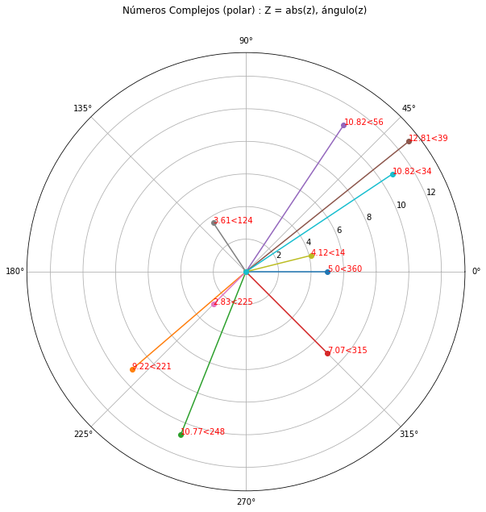
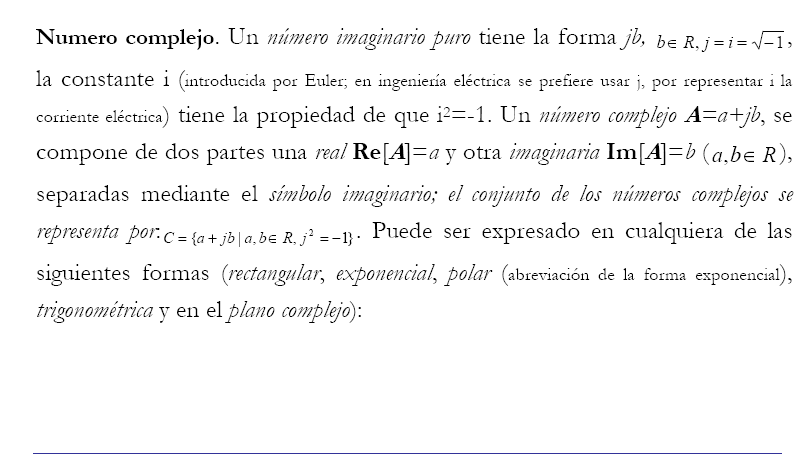
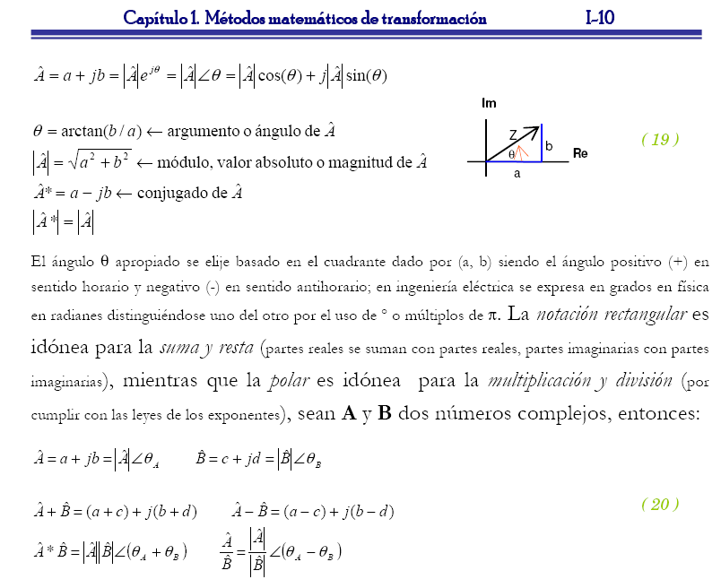
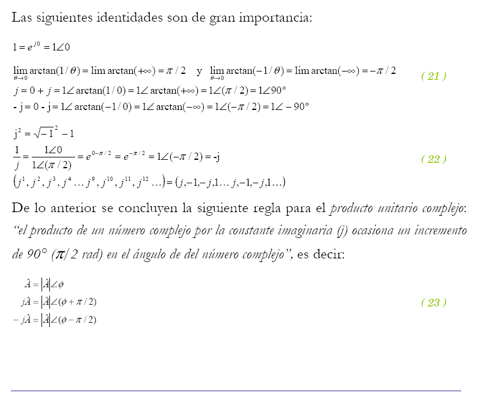
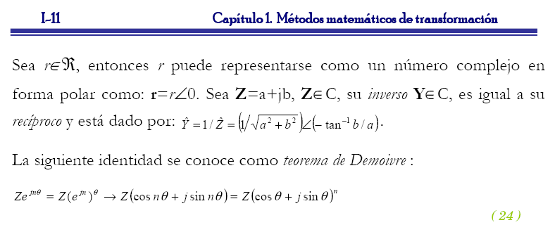

# pythoncmathscriptz1
*A python script to graphically represent complex numbers*

## Complex numbers

**Complex Numbers** is a topic I’ve always wanted to write about. First, because linear algebra is a subject with applications in virtually every field of engineering—ranging from signal processing and control theory to electromagnetism, dynamics, cartography, and more. Second, because it’s a fundamental matter in Electrical Engineering field. And third, because programming languages like Python offer powerful mathematical capabilities, making it easy to work with concepts like complex numbers.

## Related physical concepts to complex numbers
Find below some definitions to physical quantities related to complex numbers :

*<<A vector is an object that has both a magnitude and a direction. Geometrically, we can picture a vector as a directed line segment, whose length is the magnitude of the vector and with an arrow indicating the direction. The direction of the vector is from its tail to its head. Two vectors are the same if they have the same magnitude and direction. This means that if we take a vector and translate it to a new position (without rotating it), then the vector we obtain at the end of this process is the same vector we had in the beginning.>>* [mathinsight.org]

*<<Phasors are a means by which sinusoidal alternating voltages and currents can be specified in terms of a rotating radius and an angle, they behaving like vectors. A phasor represents a time-varying sinusoidal waveform by a fixed complex number. In other words a phasor is a complex number representing the amplitude and phase angle of a sinusoidal voltage and current.>>* [sciencedirect.com]

*<<A complex number is the sum of a real number and an imaginary number. A complex number is of the form a + ib and is usually represented by z; i is the square root of -1. Here both a and b are real numbers. The value 'a' is called the real part which is denoted by Re(z), and 'b' is called the imaginary part Im(z). Also, ib is called an imaginary number.>>* [cuemath.com]

*<<The rules for adding and subtracting complex numbers, namely to add or subtract corresponding components, are exactly the same as the rules for adding and subtracting vectors. Complex numbers behave exactly like two dimensional vectors. Indeed real numbers are one dimensional vectors (on a line) and complex numbers are two dimensional vectors (in a plane).>>* [nrich.maths.org/]

Vectors have application in physics to represent quantities like displacement, velocity, acceleration, force, torque, angular movement, etc; while phasors are specifically used in Electrical Engineering to analyze alternating current (AC) circuits; both of these concepts rely on the mathematics behind complex numbers. 

## Representation of complex numbers

There exist different manners to represent complex numbers, here are some of them: rectangular form, exponential form, polar form. Even when there exists some software applications like Matlab, Wolfram, Maple, Mathcad, etc to handle numerical and symbolic computation, Python is one of the languages that includes the complex numbers as part of the fundamental data-types. 

cmathpolarz1.py is a python script that uses python's math & cmath modules to implement graphical representations of complex numbers in rectangular and polar forms. Anaconda software is a free open source distribution of the Python and R languages ─for sourcing, building, and deploying data science─; Spyder is a scientific environment (IDE) written in Python.

## Polar representation of complex numbers in python

## Summary of concepts related to complex numbers (spanish) 

